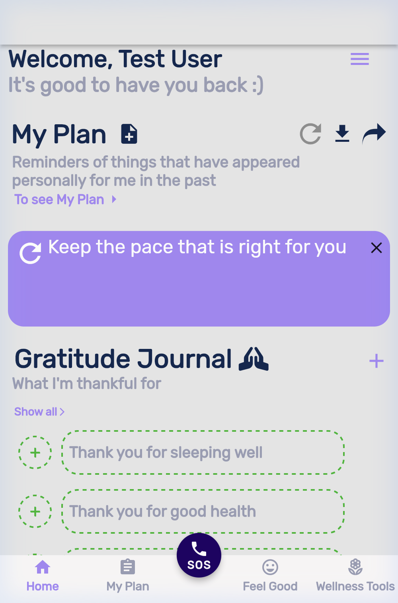
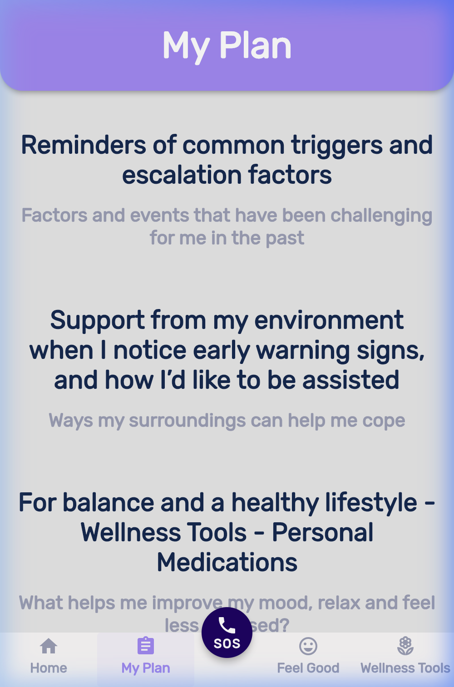
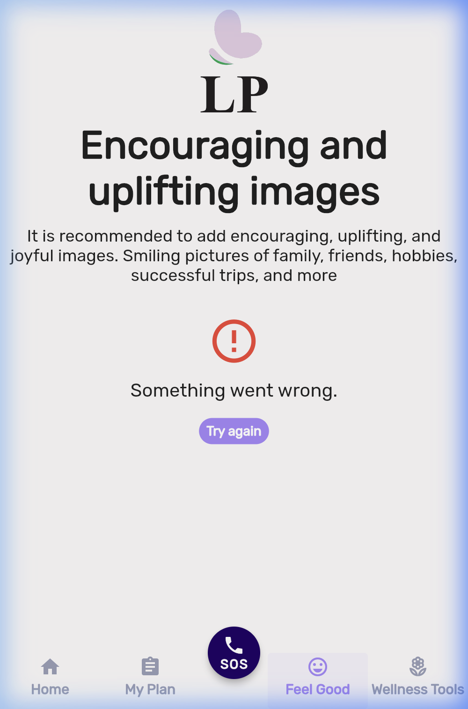

# Mezilon UI Assessment: Mobile Spacing & Layout Issues

This document summarizes the current UI spacing and layout issues across all the main pages in the Mezilon app. **This analysis was performed on a mobile viewport (390x844)** to accurately reflect how it looks on a phone.

## Why Flutter's Built-In Material UI Isn't Fixing This
Although Flutter uses Material Design by default (which has highly optimized, beautiful spacing), the app currently looks disorganized because it **overrides these sensible defaults**. 
1. **Overriding Padding**: Instead of relying on native Material padding, the codebase likely uses custom `Container` widgets with hard-coded, arbitrary paddings (e.g., `padding: EdgeInsets.all(2.0)`), discarding Material's built-in spacing.
2. **Custom Components vs. Standard Widgets**: Instead of using optimized standard widgets like `ListTile` or `Card`, the UI relies on fully custom widget trees. When building custom components, the developer is fully responsible for the math behind the padding and margins, which currently lacks a unified grid.

---

## Screen-by-Screen Breakdown (Mobile View)

````carousel

### Home Page Issues
* **Cramped Containers:** The purple "Keep the pace that is right for you" banner feels claustrophobic because the text and refresh icon lack sufficient inner padding.
* **Proximity (Gestalt):** Spacing between unrelated sections (My Plan vs. Journal) is too similar to the spacing within the sections, making the layout feel cluttered.
* **Severe Overlap:** On a mobile screen, the bottom navigation bar's central SOS button severely overlaps the gratitude journal entries, making them unreadable and untappable.

<!-- slide -->

### My Plan Page Issues
* **Wall of Text:** Everything is center-aligned without distinct cards or dividers. On a narrow mobile screen, it becomes a dense wall of text.
* **Missing Side Margins:** The text runs very close to the left and right edges of the phone screen.
* **Obscured Content:** The text at the very bottom of the screen is completely hidden underneath the SOS button and the bottom navigation bar.

<!-- slide -->

### Feel Good Page Issues
* **Vertical Rhythm:** The logo at the top is very large and sits awkwardly close to the main page title for a mobile screen.
* **Error State Alignment:** The "Something went wrong" message and the "Try again" button are floating in the center but lack structural container padding.
* **Overlap:** Once again, the bottom navigation bar SOS button overlaps the layout.

<!-- slide -->

### Wellness Tools Page Issues
* **Edge Bleeding:** The "More videos" list items have images that bleed entirely into the left edge of the phone screen with zero padding.
* **List Item Spacing:** The list items are stacked directly on top of each other with zero vertical padding between the rows, making them look cramped and hard to tap on a phone. The text is also crammed right against the thumbnails.
* **Bottom Overlap:** The SOS button on the bottom nav still overlaps the last list item.
````

> [!TIP]
> **Recommendation:** We need to refactor the `styles.dart` file to export a strict set of spacing tokens (e.g., `Spacing.sm = 8.0`, `Spacing.md = 16.0`, `Spacing.lg = 32.0`) and apply these uniformly across all screens. **Crucially, we must add a `bottomPadding` to all scrollable views equal to the height of the bottom navigation bar so content doesn't get hidden behind the SOS button.**
